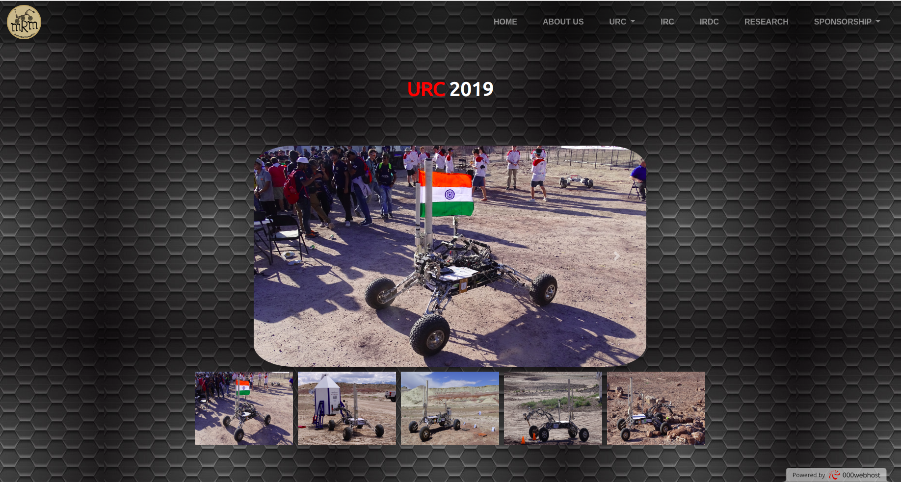
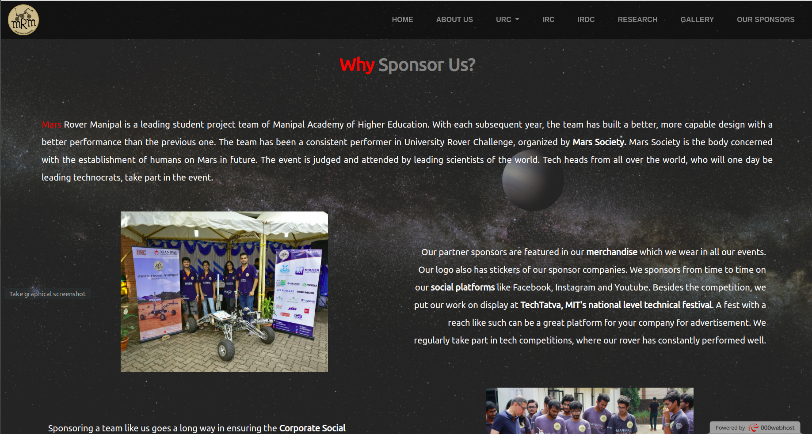
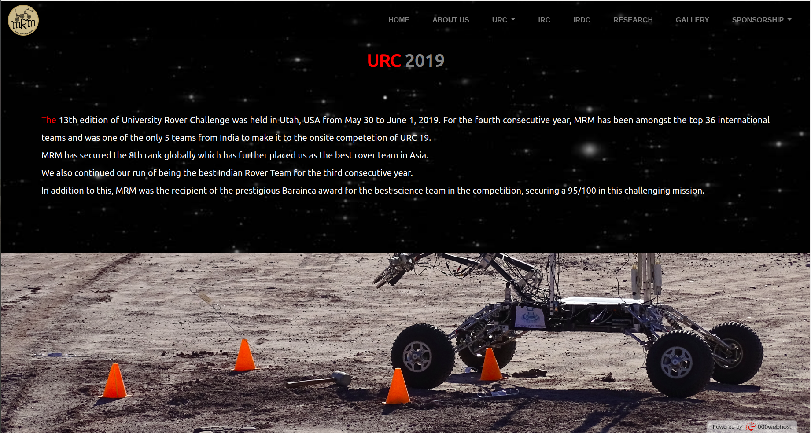

# Website for MRM
Mars Rover Manipal is a student team from Manipal Academy of Higher Education that aims at building next-generation Mars rovers.

The full website can be found [here](https://mars-rover-manipal.000webhostapp.com/) 

## Technologies Used
* HTML
* CSS
* Bootstrap

Following are some screenshots of the webpages developed using only **HTML** and **CSS**.

### Home Page

### Gallery Page

### Sponsor Us Page

#### Competition page

